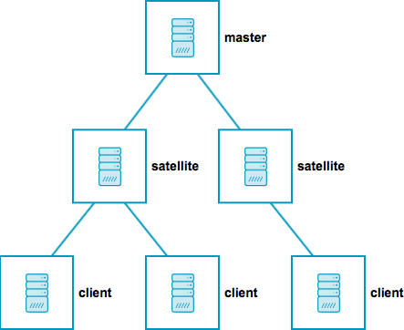

# Introduction 

## Why should you monitor NTP peers?

> Monitoring without **exact timestamp** is worthless.
>
> [WOLS](https://github.com/wols)

Let's take an example: [Icinga2 - Distributed Monitoring with Master, Satellites, and Clients](https://icinga.com/docs/icinga2/latest/doc/06-distributed-monitoring/), 2018-12-10T21:15:00

TO BE CONTINUED...

### Sources

* [Arnold, Doug: The virtues of clock watching: Why it's important to monitor your timing network](https://blog.meinbergglobal.com/2018/05/10/the-virtues-of-clock-watching-why-its-important-to-monitor-your-timing-network/), 2018-12-10T21:15:00

## How should you monitor NTP peers?

### Peers

[Read more...](11-Peers.md#module_ntpstatsng_peers)

### Probes

[Read more...](12-Probes.md#module_ntpstatsng_probes)

### Controllers

[Read more...](13-Controllers.md#module_ntpstatsng_controllers)

----

[NTPstats-NG](/icingaweb2/doc/module/toc?moduleName=ntpstatsng) &#169; 2016-2018 [WOLS](https://github.com/wols/icingaweb2-module-ntpstatsng)
